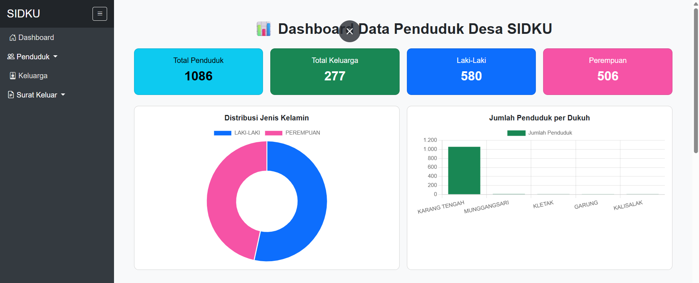
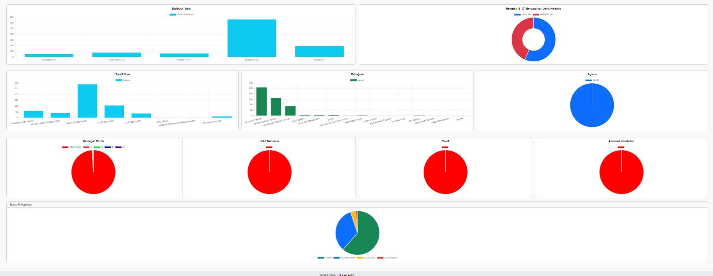
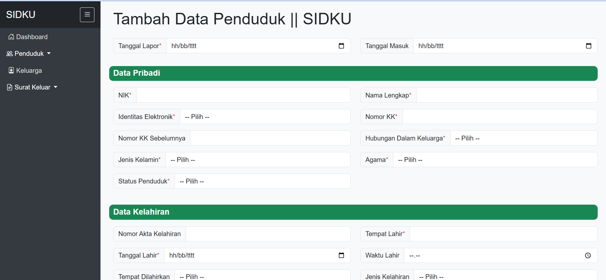
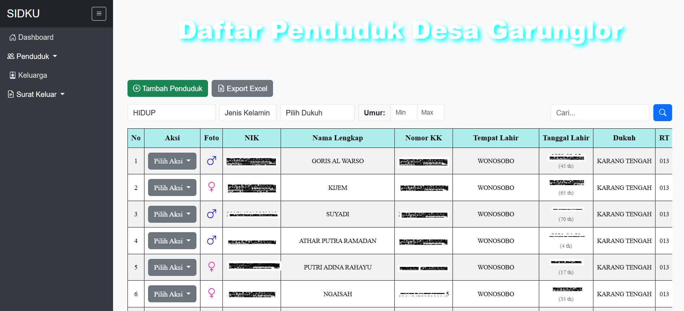
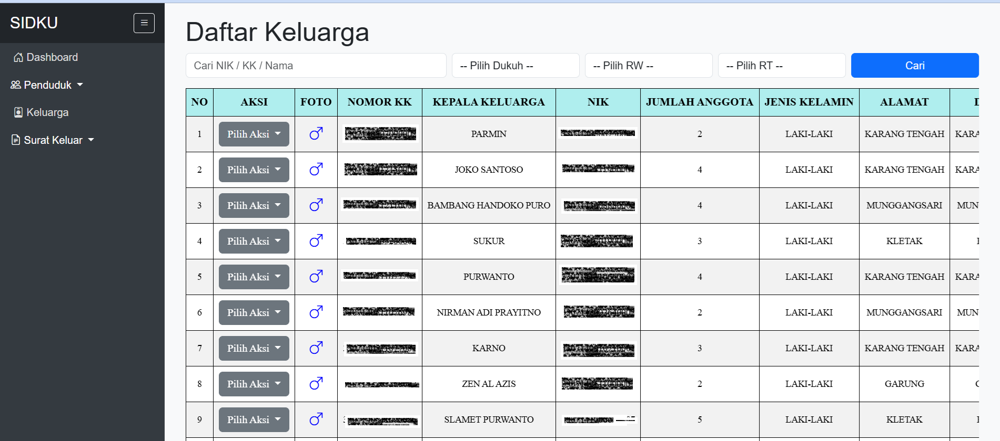
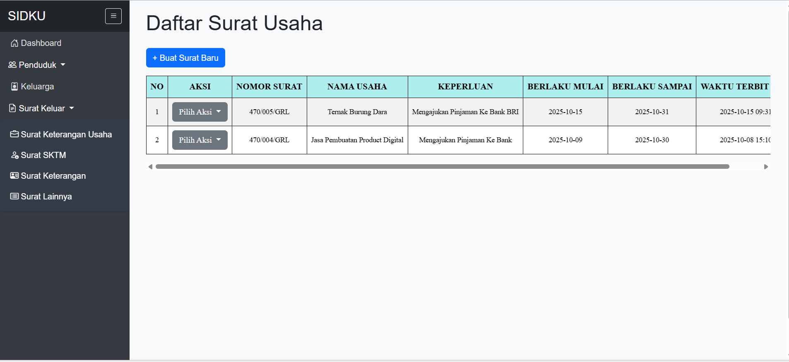
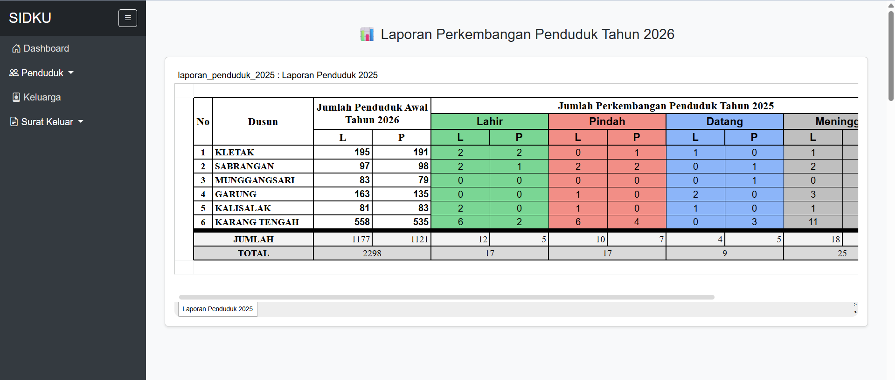

# 🏘️ Laravel-Sistem Informasi Desaku (SIDKU)

**SIDKU** adalah solusi digital untuk manajemen kependudukan dan administrasi desa yang efisien, transparan, dan modern.

---

---

## 📺 Demo Video & Gambar
> [Link Video Demo di YouTube/Google Drive]

Berikut adalah tampilan antarmuka dari Sistem Informasi Desaku:

| Halaman Dashboard | Diagram Dashboard |
|---|---|
|  |  |

| Input Penduduk |  Daftar Penduduk |
|---|---|
|  |  |

| Daftar Keluarga | Input Dan Laporan Surat |
|---|---|
|  |  |

|Laporan Kependudukan |
|---|
|

---

## ✨ Fitur Utama
* **Manajemen Warga:** Database NIK & KK yang terintegrasi.
* **Automasi Surat:** Cetak surat keterangan/pengantar otomatis.
* **Statistik Visual:** Dashboard statistik penduduk (Pekerjaan, Umur, Jenis Kelamin).
* **Export PDF:** Hasil dokumen profesional menggunakan DomPDF.
* **Manajemen Data Warga:** CRUD data kependudukan yang cepat dan valid.
* **Statistik Real-time:** Visualisasi data menggunakan Chart.js.
* **Cetak Surat Otomatis:** Generasi dokumen PDF (Surat Pengantar, dll) dengan DomPDF.
* **Laporan Excel:** Ekspor data penduduk ke format spreadsheet.

---

## 🛠️ Tech Stack
* **Framework:** Laravel 11
* **Database:** MySQL
* **UI:** Tailwind CSS / Bootstrap
* **Charts:** Chart.js

---

## 📦 Cara Instalasi

1. Clone repository: `git clone https://github.com/AzisCode412/Laravel-SIDKU-Sistem-Informasi-Desaku.git`
2. Masuk ke folder: `cd Laravel-SIDKU-Sistem-Informasi-Desaku`
3. Install dependencies: `composer install` & `npm install`
4. Copy .env: `cp .env.example .env`
5. Generate key: `php artisan key:generate`
6. Migrasi database: `php artisan migrate --seed`
7. Jalankan: `php artisan serve`

---

## 💰 Cara Mendapatkan Source Code
Repositori ini hanya berisi dokumentasi dan demo. Untuk mendapatkan **Source Code Lengkap (Full Access)**, Anda dapat menghubungi saya melalui jalur berikut:

1. **Instagram:** [@teman_tugasmu_](https://instagram.com/teman_tugasmu_) (Respon Cepat)
2. **GitHub:** Kirim pesan melalui profil atau minta akses (Request Access).

**Apa yang Anda dapatkan?**
* Full Source Code (Laravel Project).
* Database Schema (.sql).
* Panduan Instalasi Lengkap.
* Konsultasi/Support jika ada kendala instalasi.

Copyright © 2026 **Zen Al Azis**. All rights reserved.
